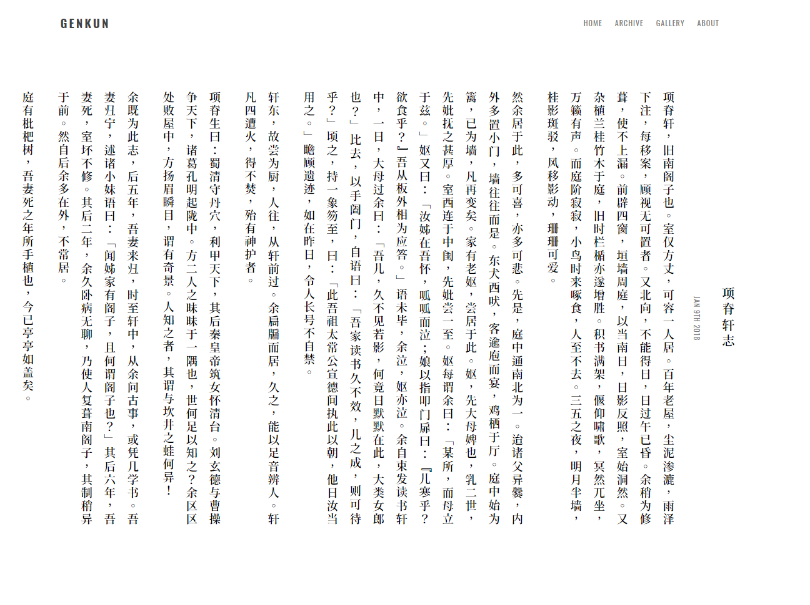

# DIVINE

- [Preview](https://www.divinerhjf.com)

该主题为 [Huruko](https://github.com/GenkunAbe/hugo-theme-hiruko/) 的魔改版，仅作私人使用。

## 功能

- **MathJax 公式支持**

用法：将 `mathjax: true` 加入到文章的 `front-matter` 中。

- **Disqus 评论系统**

用法：在 `config.toml` 中加入代码。

    ```
    [params]
        disqus = "your-disqus-username"
    ```

- **直排模式**

    

用法：将 `vertical: true` 加入到文章的 `front-matter` 中。

- **网络字体**

[Font-Spider](https://github.com/aui/font-spider) 提供支持。

## 使用本主题

- **安装**

    ``` bash
    $ git submodule add https://github.com/DivinerHJF/hugo-theme-divine.git themes/divine
    ```

- **开启**

将 `theme = "divine"` 加入到 `config.toml` 中。

- **更新**

    ``` bash
    git submodule update --recursive --remote
    ```
